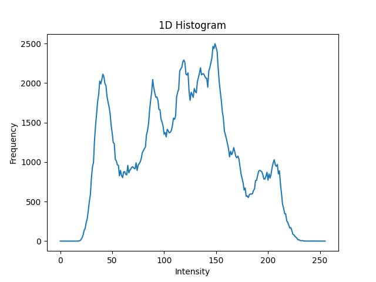
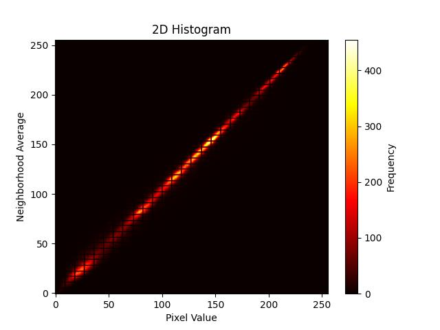
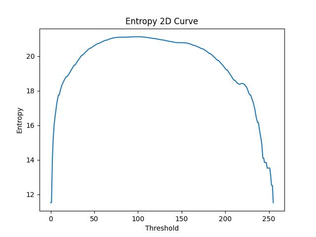
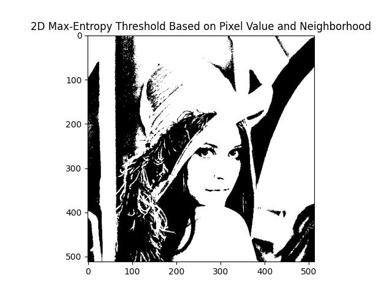

## 作业一

### 需求：

实现基于一维直方图及二维直方图的最大熵阈值分割算法，画出相应直方图、阈值选择的熵图，3副
不同类型的分割结果图，并对结果进行分析，得出有效结论。

### 实现

1. 安装和导入相关的库
2. 读取图像
3. 计算直方图
4. 计算最大熵得到阈值
5. 分割图像


### 操作指南

```angular2html
pip install skimage
```

#### 最大熵-1d
```angular2html
python main.py --algo 1d
```

一维直方图


一维熵图


一维分割图


#### 最大熵-2d

```angular2html
python main.py --algo 2d
```

二维直方图


二维熵图


二维分割图


### 结论
二维考虑了邻域，更关注边缘。