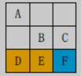

## 实验二：搜索算法

### 实验目的
1. 掌握搜索算法的基本设计思想与方法.
2. 掌握 A*算法的设计思想与方法.
3. 熟练使用高级编程语言实现搜索算法.
4. 利用实验测试给出的搜索算法的正确性


### 实验问题

寻路问题。以图 1 为例，输入一个方格表示的地图，要求用 A*算法找到并
输出从起点（在方格中标示字母 S）到终点（在方格中标示字母 T）的代价最小的路径。有如下条件及要求：

1. 每一步都落在方格中，而不是横竖线的交叉点。
2. 灰色格子表示障碍，无法通行。
3. 在每个格子处，若无障碍，下一步可以达到八个相邻的格子，并且只可以到达无障碍的相邻格子。其中，向上、下、左、右四个方向移动的代价为 1， 向
四个斜角方向移动的代价为√2。
4. 在一些特殊格子上行走要花费额外的地形代价。比如，黄色格子代表沙漠，
经过它的代价为 4；蓝色格子代表溪流，经过它的代价为 2；白色格子为普通地
形，经过它的代价为 0。
5. 经过一条路径总的代价为移动代价+地形代价。其中移动代价是路径上所做
的所有移动的代价的总和；地形代价为路径上除起点外所有格子的地形代价的总
和。比如，在下图的示例中，路径 A→B→C 的代价为√2+1(移动)+0(地形)，而
路径 D→E→F 的代价为 2(移动)+6(地形)。


```
输入: points = [[1,1],[2,2],[2,0],[2,4],[3,3],[4,2]]
输出: [[1,1],[2,0],[3,3],[2,4],[4,2]]
```

### 实验步骤


4.1 实现基于枚举方法的凸包求解算法

```bash
python main.py --algo bruteForce --sizes 10,20,30
```


4.2 实现基于 Graham-Scan 的凸包求解算法

```bash
python main.py --algo grahamScan --sizes 1000,2000,3000
```


4.3 实现基于分治思想的凸包求解算法
```bash
python main.py --algo div --sizes 1000,2000,3000
```


4.4 对比三种凸包求解算法 

（1）实现随机生成正方形(0,0)-(0,100)-(100,100)-(100,0)内的点集合 Q 的算法；

（2）利用点集合生成算法自动生成大小不同数据集合，如点数大小分别为(1000，
2000，3000…)的数据集合；

（3）对每个算法，针对不同大小的数据集合，运行算法并记录算法运行时间；

（4）对每个算法，绘制算法性能曲线，对比算法。
 