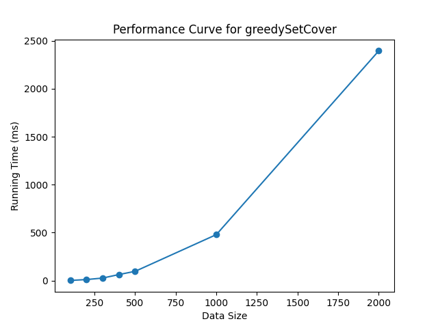
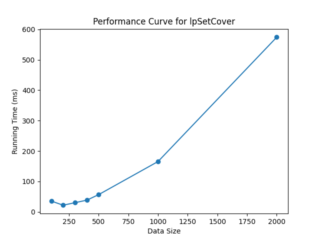

## 实验三：近似算法

### 实验目的

1. 掌握近似算法的基本设计思想与方法。
2. 掌握集合覆盖问题近似算法的设计思想与方法。
3. 熟练使用高级编程语言实现近似算法。
4. 利用实验测试给出不同近似算法的性能以理解其优缺点。

### 实验问题

集合覆盖问题： 
从集族F中挑选一些集合覆盖全集U中的所有元素,
挑选的集合个数最少


```
Input: universe={1,2,3,4,5}, subsets = {{1,2,3},{2,4},{3,4},{4,5}}
Output: {{1,2,3},{4,5}}
```


### 实验环境

```bash
pip install pulp
```

### 实验步骤


1. 实现基于贪心策略的近似算法

```bash
python main.py --algo greedySetCover --sizes 100,200,300,400,500,1000,2000
```



2. 实现一个基于线性规划近似算法


```bash
python main.py --algo lpSetCover --sizes 100,200,300,400,500,1000,2000
```


