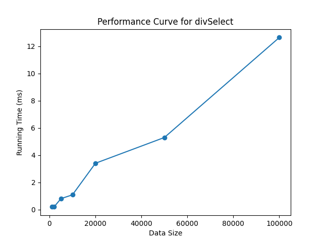
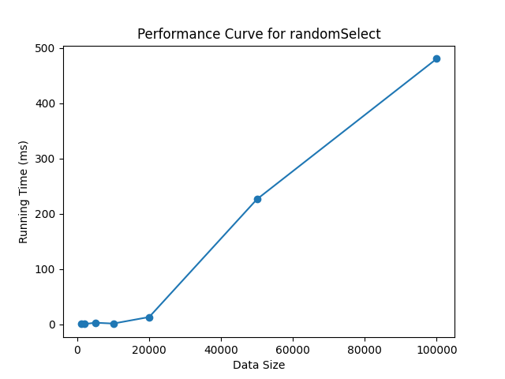

## 实验四：计算 k 位数的随机算法

### 实验目的
1. 掌握分治算法和随机算法的设计思想与方法。
2. 熟练使用高级编程语言实现分治算法和随机算法。
3. 通过对比不同参数，理解算法具体原理，理解分治算法和随机算法。

### 实验问题
输入：乱序实数数组𝐴 = {𝑥1, 𝑥2, . . . , 𝑥n}
输出：𝐴的第 k 小元素

 
```
输入: nums=[3,2,1,5,6,4], k = 2
输出: 2
```


### 实验步骤


1. 实现基于分治方法的 k 位数算法

```bash
python main.py --algo divSelect --sizes 1000,2000,5000,10000,20000,50000,100000
```



2. 实现基于随机方法的 k 位数算法

```bash
python main.py --algo randomSelect --sizes 1000,2000,5000,10000,20000,50000,100000
```


