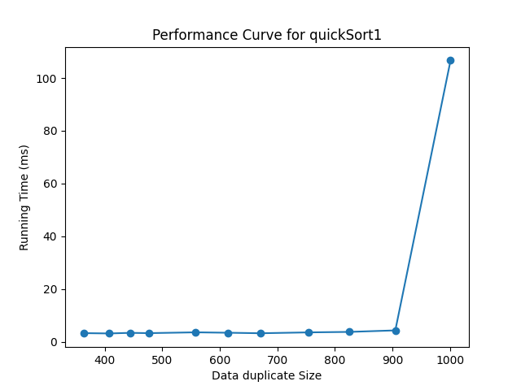
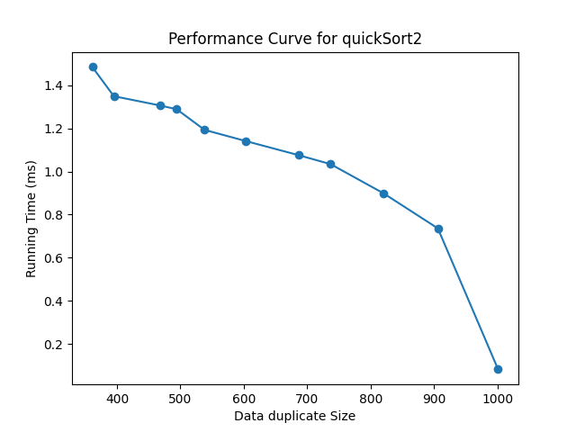

## 实验五：快速排序

### 实验目的
1. 掌握快速排序随机算法的设计思想与方法。
2. 熟练使用高级编程语言实现不同的快速排序算法。
3. 利用实验测试给出不同快速排序算法的性能以理解其优缺点。

### 实验问题
快速排序是算法导论中的经典算法。在本实验中，给定一个长为 n 的整数数
组，要求将数组升序排序。

 
```
输入: nums = [1,7,3,5,4,2,2]
输出: [1, 2, 2, 3, 4, 5, 7]
```


### 实验步骤


4.1 按照算法导论中给出的伪代码实现快速排序

```bash
python main.py --algo quickSort1 --size 1000
```



4.2 测试算法在不同输入下的表现

```bash
python main.py --algo quickSort2 --size 1000
```



