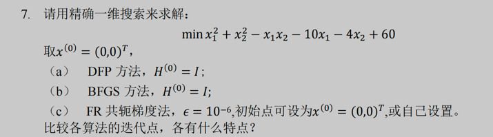

## 实验一

### 实验要求

熟悉基本的平台，搭建基本的优化算法实现和验证框架，对**无约束优化**问题进行求解和验证，尤其对**一阶、二阶和无导数**求解算法进行
实验。（可以整理作业代码）

### 实验内容

方便起见，可以就着作业2的第7题，来实验一下。

- [x] 无导数（这个可以直接使用Nelder-Mead）
- [x] 一阶(FR和GD)
- [x] 二阶(Newton，DFP,BFGS)