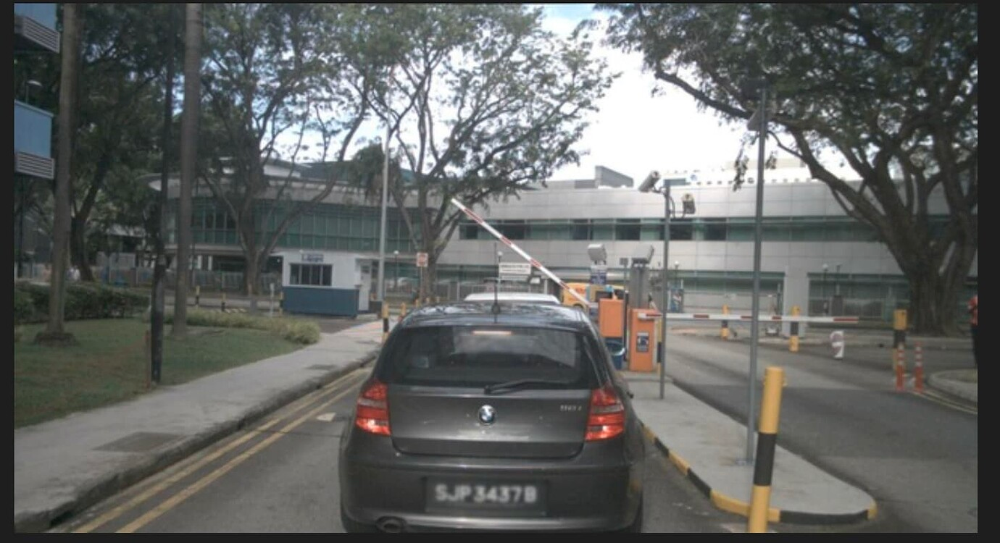
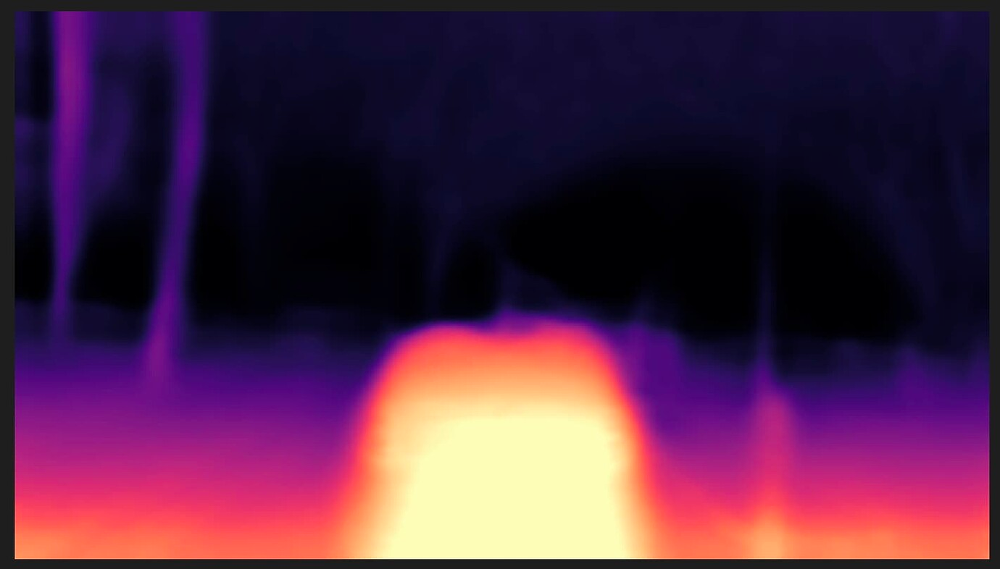

## 实验二

实验二复现了基于nuscenes数据集下的surroundDepth方法。

### 1. 环境
```bash
rlaunch --gpu=8 --cpu=16 --memory=64000 --positive-tags=2080ti -- bash
git clone https://github.com/weiyithu/SurroundDepth.git
conda create -n surrounddepth python=3.8
conda activate surrounddepth
pip install -r requirements.txt
```


### 2. 数据集

```angular2html
SurroundDepth
├── data
│   ├── nuscenes
│   │   │── raw_data
│   │   │   │── samples
|   |   |   |── sweeps
|   |   |   |── maps
|   |   |   |── v1.0-trainval
|   |   |── depth
│   │   │   │── samples
|   |   |── match
│   │   │   │── samples
```


已有Nuscenes数据集（需要修改nusc_dataset以及export_gt的路径）
```angular2html
cd tools
python export_gt_depth_nusc.py val # 用来测试
python export_gt_depth_nusc.py train # 用来训练

├── nuscenes
│   ├── depth （可以可视化拿出来看看）
│   ├── lidarseg
│   ├── maps
│   ├── samples
│   ├── sweeps
│   ├── v1.0-mini
│   ├── v1.0-test
│   └── v1.0-trainval
```


### 3. 测试

```bash
python -m torch.distributed.launch --nproc_per_node ${NUM_GPU}  run.py  --model_name test  --config configs/${TYPE}.txt --models_to_load depth encoder   --load_weights_folder=${PATH}  --eval_only 
```
- 可视化结果：

- 


### 4. 训练

```bash
python -m torch.distributed.launch --nproc_per_node 8  run.py  --model_name nusc_scale  --config configs/nusc_scale.txt  --load_weights_folder=${best pretrained}
```

